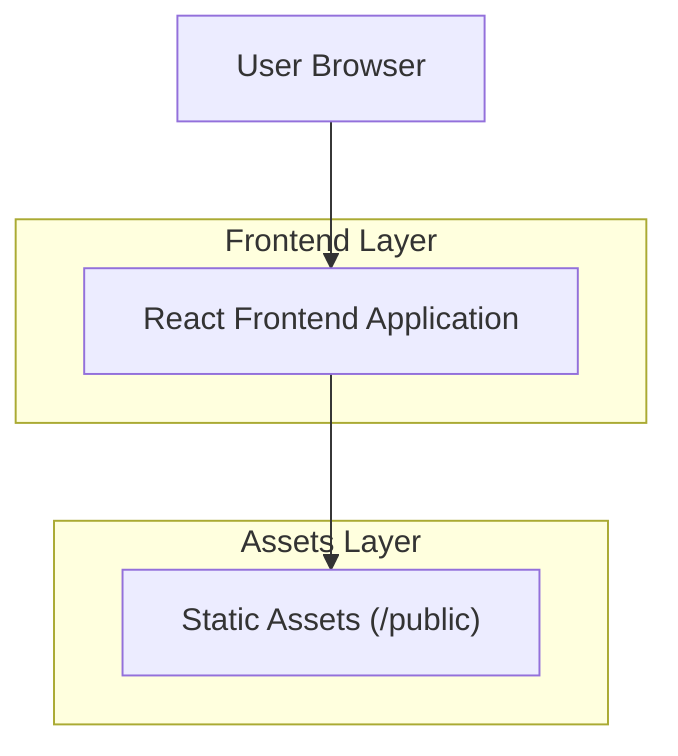

## 1.Architecture design


## 2.Technology Description
- Frontend: React@18 + TypeScript + vite
- Backend: None
- Styling: CSS (variables globales + componentes con CSS Modules o CSS por sección)

## 3.Route definitions
| Route | Purpose |
|-------|---------|
| / | Página principal con secciones; navegación por hash (#inicio, #historia, #juego, #bebe, #galeria). |

## 4.API definitions (If it includes backend services)
No aplica (sin backend).

## 6.Data model(if applicable)
No hay base de datos.

### Modelo de datos en frontend (TypeScript)
```ts
export type StoryChapter = {
  id: string;
  emoji: string;
  title: string;
  teaser: string;
  body: string;
  defaultOpen?: boolean;
};

export type GameMemory = {
  id: string;
  emoji: string;
  title: string;
  subtitle: string;
  text: string;
  img?: string; // ruta en /public (ej: "/foto-1.jpg")
};

export type GalleryItem = {
  id: string;
  label: string;
  img?: string; // ruta en /public
};
```

### Estructura recomendada del proyecto (alto nivel)
- src/
  - app/App.tsx (compone secciones)
  - components/
    - TopNav.tsx
    - StorySection.tsx
    - BabySection.tsx
    - GallerySection.tsx
    - GameSection/
      - GameSection.tsx (estado y controles)
      - GameGrid.tsx (reto)
      - GameTrack.tsx (nodos bloqueados/desbloqueados)
      - MemoryModal.tsx
  - data/
    - storyChapters.ts
    - gameMemories.ts
    - galleryItems.ts
  - styles/
    - globals.css (tokens + fondo + cards)

### Decisiones clave de migración (del HTML actual a React)
- HTML estático → componentes: cada sección del <main> se convierte en un componente con props/datos.
- DOM imperative (createElement/innerHTML) → render declarativo: nodos del juego y celdas se generan con map() + estado (useState).
- Dataset escondido (#gameEventData) → arrays tipados (GameMemory[]) en src/data.
- Modal y accesibilidad: estado isOpen, foco en botón de cerrar, cierre por overlay y Escape.
- Assets (fotos/mp3) → /public y referencias por ruta absoluta ("/tu-cancion.mp3", "/foto-1.jpg").