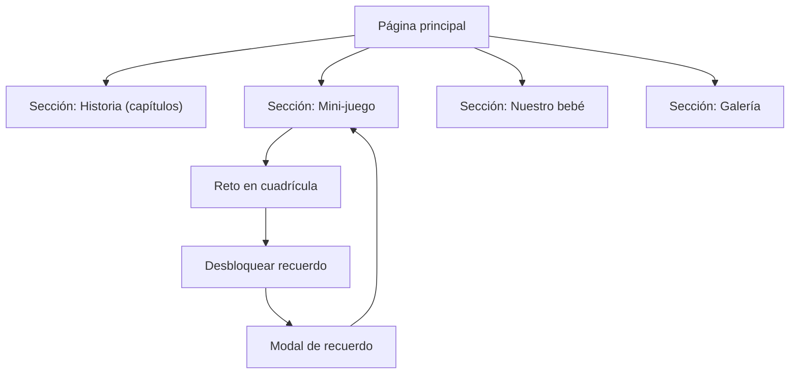

## 1. Product Overview
Una app web romántica en React (single-page) que presenta tu historia por capítulos, una sección dedicada al bebé, una galería y un mini‑juego que desbloquea recuerdos.
Sirve como regalo interactivo, fácil de personalizar con textos, fotos y música.

## 2. Core Features

### 2.1 Feature Module
Esta app se compone de las siguientes páginas principales:
1. **Página principal (una sola página con secciones)**: navegación fija, portada, historia por capítulos, sección bebé, galería, mini‑juego con recuerdos desbloqueables y modal de recuerdo.

### 2.3 Page Details
| Page Name | Module Name | Feature description |
|-----------|-------------|---------------------|
| Página principal | Navegación superior | Mostrar enlaces a secciones mediante anclas (#inicio, #historia, #juego, #bebe, #galeria). |
| Página principal | Historia (capítulos) | Mostrar capítulos en acordeón (expandir/contraer) con título, emoji e intro de texto. |
| Página principal | Sección bebé | Mostrar mensajes fijos en formato lista (sueño, promesa, deseo). |
| Página principal | Galería | Mostrar una cuadrícula de “cards”/fotos con placeholder cuando no haya imagen. |
| Página principal | Mini‑juego (progreso) | Mostrar camino de nodos bloqueados/desbloqueados; permitir “Empezar”, “Avanzar” y “Reiniciar”. |
| Página principal | Mini‑juego (reto) | Generar cuadrícula (3×3 a 5×5) y permitir descubrir el capibara; al acertar, desbloquear el siguiente recuerdo. |
| Página principal | Modal de recuerdo | Abrir modal con título, subtítulo, texto e imagen opcional; permitir cerrar (botón, click fuera, tecla Escape). |
| Página principal | Personalización de contenidos | Cargar capítulos, recuerdos del juego y galería desde un archivo de datos (JSON/TS) para editar sin tocar lógica. |

## 3. Core Process
Flujo principal (persona usuaria):
1. Entras a la portada y usas la navegación para ir a Historia, Juego, Bebé o Galería.
2. En Historia, abres/cierra capítulos para leer.
3. En Juego, pulsas “Empezar”, luego “Avanzar” para lanzar un reto; al encontrar el capibara se desbloquea un recuerdo y se abre un modal.
4. Repites el reto hasta desbloquear todos los recuerdos o reinicias.
5. En Galería, recorres las fotos/recuerdos.

